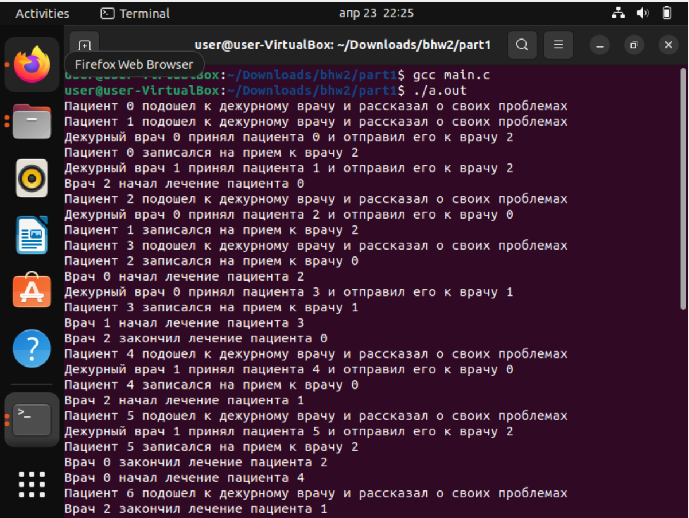
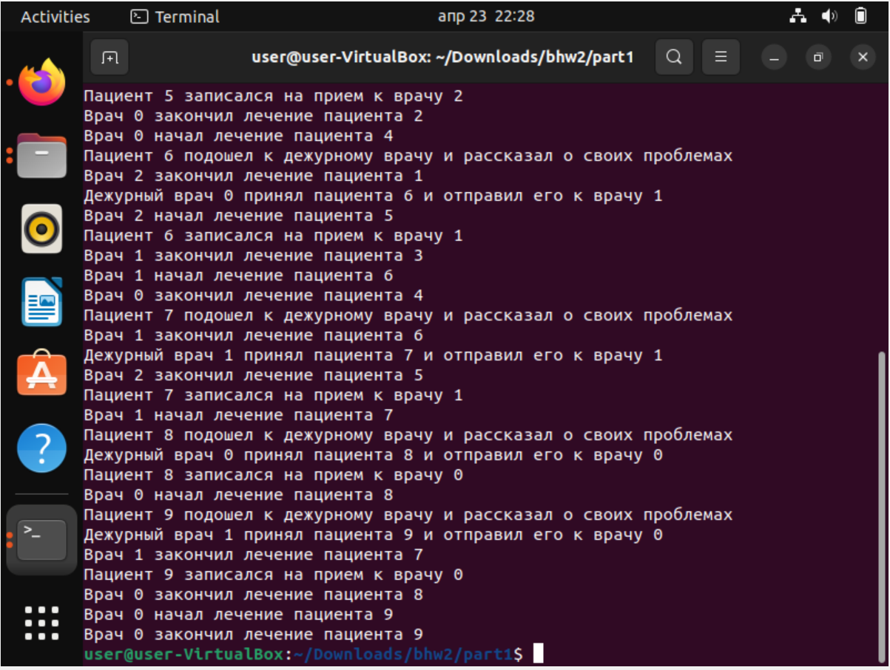
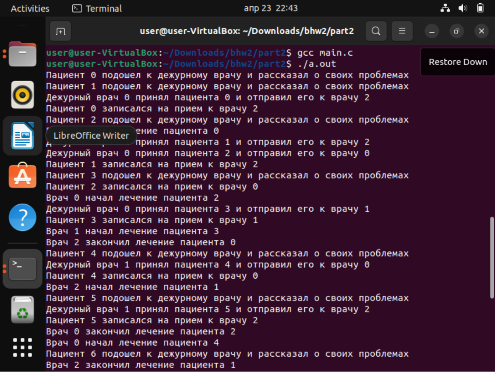
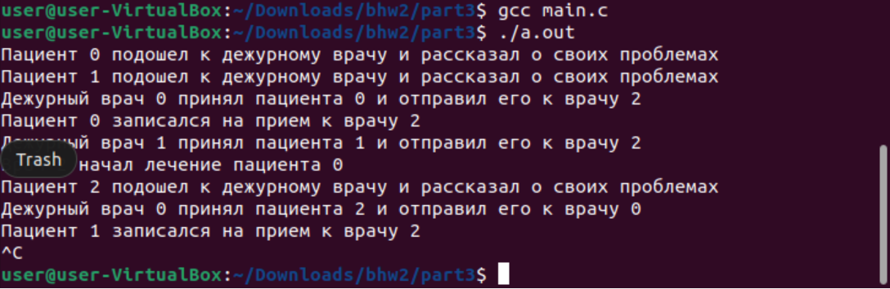
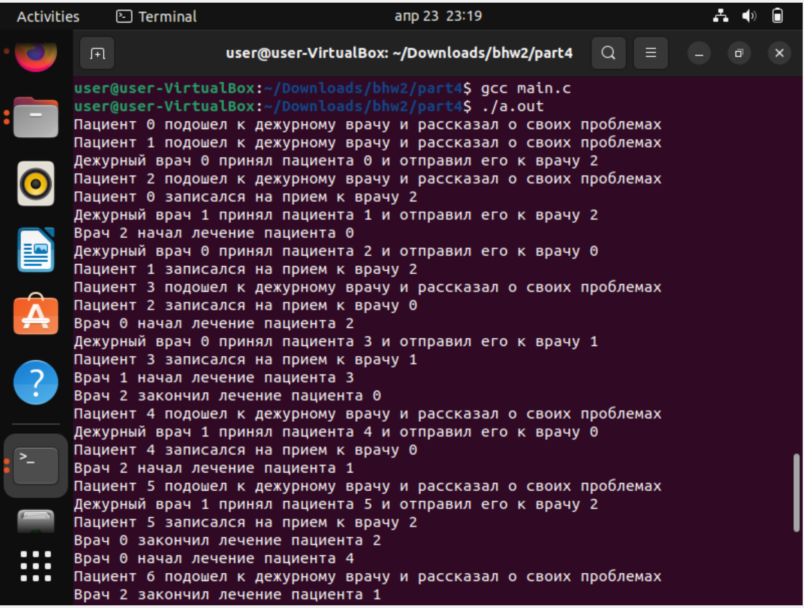
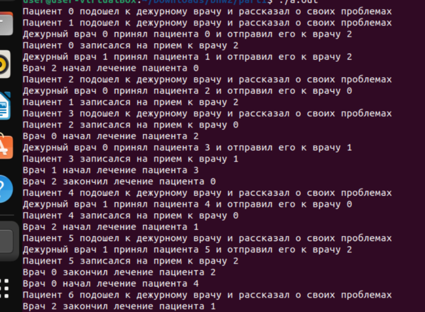

Багрянский Константин Дмитриевич

БПИ218

Вариант 11

```
Задача о больнице. В больнице два дежурных врача принимают
пациентов, выслушивают их жалобы и отправляют или к стоматологу, 
или к хирургу, или к терапевту. Стоматолог, хирург и терапевт 
лечат пациентов. Каждый врач может принять только одного
пациента за раз. Пациенты стоят в очереди к врачам и никогда их
не покидают. Создать приложение, моделирующее рабочий
день клиники. Каждого врача и каждого пациента реализовать
в виде отдельного процесса.
```
Сценарий решаемой задачи:
При запуске программы создаются 2 процесса дежурных врача, хирург(0), стомотолог(1) и терапевт(2).
Потом создаются пациенты (10 штук).
Два дежурных врача по порядку вызывают пациентов из очереди, 
после чего тратят необходимое на регистрацию время. 
Дежурные врачи работают, пока очередь на регистрацию не опустеет.

После распределения пациент попадает в очередь к одному из специалистов, 
который так же вызывает пациентов по порядку их прихода. 
Далее тратит на них необходимое время для осмотра, после чего зовет следующего. 
Специалисты работают, пока больница не опустеет. Важно отметить, что у врача проверяется, 
что очередь не пуста, поскольку условие работы каждого врача обобщено с помощью количества 
пациентов по всей больнице.

Особенности решений на каждую оценку
на 4: использование именованных семафоров POSIX и разделяемой памяти POSIX
папка /part1


на 5: использование неименованных семафоров POSIX и разделяемой памяти POSIX
папка /part2

на 6: использование семафоров SYSTEM V и разделяемой памяти SYSTEM V
папка /part3

На этом скриншоте видно как работает sigint
на 7: использование именованных семафоров POSIX и разделяемой памяти POSIX
папка /part4

на 8: использование семафоров SYSTEM V и разделяемой памяти SYSTEM V
папка /part5

